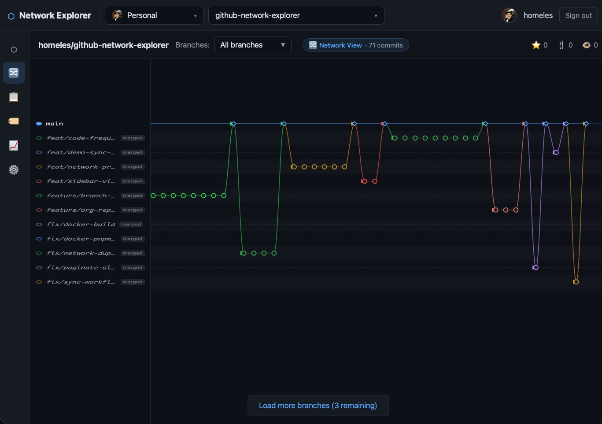
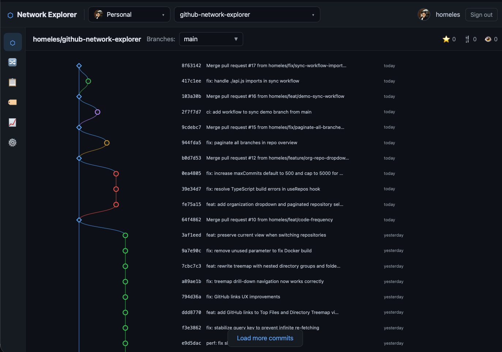
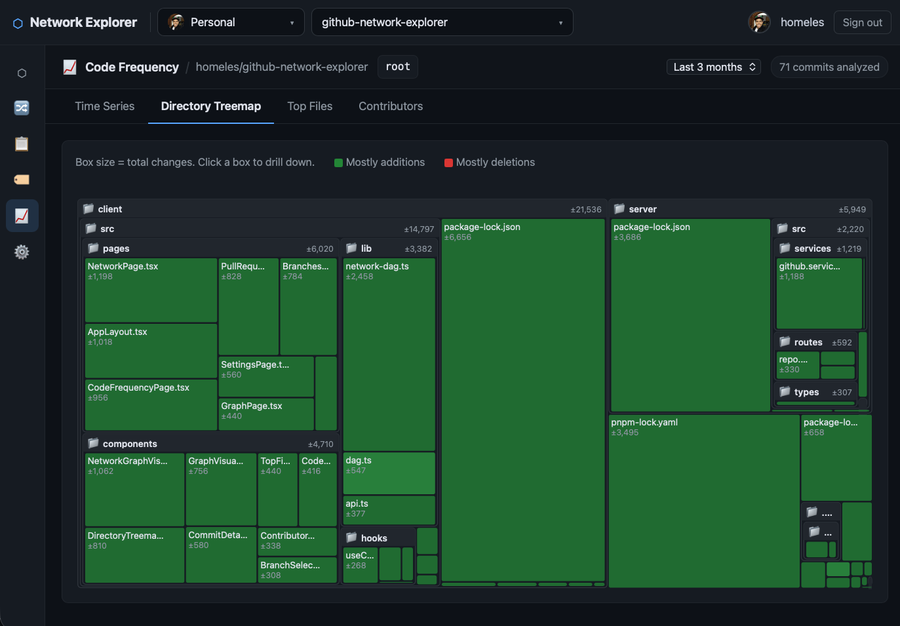

# GitHub Network Explorer

An interactive GitHub network graph visualizer that extends the native GitHub Network Graph. Explore branches, merges, commit history, CI status, pull requests, and code frequency analytics through a visual DAG.



---

## Features

- **Network graph** — multi-branch commit visualization with color-coded lanes, merge diamonds, and branch labels with status badges
- **Interactive commit DAG** — SVG-based visualization with zoom/pan, lane-based branch layout, and Bezier curve edges
- **Commit detail panel** — SHA, author, date, file changes, additions/deletions, associated PRs, CI status
- **Code frequency analytics** — time series charts, directory treemap, top files by changes, and contributor breakdown
- **Branch & tag browsing** — switch branches from a dropdown; paginated loading for repos with many branches
- **Organization & repo selector** — browse personal and org repositories from the top navigation
- **Pull requests feed** — view open, closed, and merged PRs with status indicators
- **GitHub OAuth** — secure OAuth 2.0 flow with session-based token storage
- **Caching** — 5-minute in-memory cache (node-cache) on all API responses
- **Pagination** — infinite scroll / load-more for large commit histories
- **Dark theme** — GitGraph Obsidian design, built with shadcn/ui and Tailwind CSS

---

## Screenshots

### Network View
All branches visualized as a color-coded commit graph with merge points and branch status badges.


### Commit History
Single-branch DAG with commit messages, SHAs, and timestamps. Click any commit for full details.



### Code Frequency
Analyze repository activity with time series, directory treemap, top files, and contributor views.



---

## Architecture

```
github-network-explorer/
├── client/          # React 19 + Vite + TypeScript + Tailwind CSS
│   └── src/
│       ├── components/   GraphVisualization, NetworkGraphVisualization,
│       │                 DirectoryTreemap, CodeFrequencyChart, ...
│       ├── hooks/        useAuth, useRepos, useCommits
│       ├── lib/          api.ts, dag.ts, network-dag.ts
│       └── pages/        LoginPage, AppLayout, GraphPage,
│                         NetworkPage, CodeFrequencyPage, ...
├── server/          # Express.js + TypeScript
│   └── src/
│       ├── routes/       auth.routes, repo.routes
│       ├── services/     github.service, cache.service
│       ├── middleware/   auth.middleware
│       └── types/        index.ts
├── docs/images/     Screenshots
├── Dockerfile       Multi-stage build
├── docker-compose.yml
└── pnpm-workspace.yaml
```

**API routes**

| Method | Path | Description |
|--------|------|-------------|
| `POST` | `/api/auth/github` | Initiate GitHub OAuth flow |
| `GET` | `/api/auth/callback` | OAuth callback handler |
| `GET` | `/api/auth/status` | Auth status + current user |
| `POST` | `/api/auth/logout` | Destroy session |
| `GET` | `/api/repos` | List authenticated user's repos |
| `GET` | `/api/repos/:owner/:repo/overview` | Branches, tags, stars, forks |
| `GET` | `/api/repos/:owner/:repo/commits/:branch` | Paginated commit history |
| `GET` | `/api/repos/:owner/:repo/commit/:sha` | Full commit detail |
| `GET` | `/api/repos/:owner/:repo/branches` | List all branches |
| `GET` | `/api/repos/:owner/:repo/pulls` | Pull requests |
| `GET` | `/api/repos/:owner/:repo/code-frequency` | Code frequency analytics |

---

## Prerequisites

- [Node.js](https://nodejs.org/) 22+
- [pnpm](https://pnpm.io/) 9+
- A [GitHub OAuth App](https://github.com/settings/developers)

### Create a GitHub OAuth App

1. Go to **GitHub -> Settings -> Developer settings -> OAuth Apps -> New OAuth App**
2. Set **Homepage URL** to `http://localhost:5173` (development)
3. Set **Authorization callback URL** to `http://localhost:3001/api/auth/callback`
4. Copy the **Client ID** and generate a **Client Secret**

---

## Local Development

### 1. Clone and install

```bash
git clone <repo-url>
cd github-network-explorer
pnpm install
```

### 2. Configure environment

```bash
cp .env.example .env
```

Edit `.env` and fill in:

```
GITHUB_CLIENT_ID=<your-client-id>
GITHUB_CLIENT_SECRET=<your-client-secret>
SESSION_SECRET=<random-string-at-least-32-chars>
CLIENT_URL=http://localhost:5173
SERVER_URL=http://localhost:3001
PORT=3001
NODE_ENV=development
```

### 3. Start dev servers

```bash
pnpm dev
```

This runs both servers concurrently:
- **Client**: http://localhost:5173
- **Server**: http://localhost:3001

---

## Production Build

```bash
pnpm build
```

In production, the Express server serves the built client files from `client/dist`.

```bash
NODE_ENV=production node server/dist/index.js
```

---

## Docker

```bash
# Build and run with Docker Compose
docker-compose up --build

# App available at http://localhost:3001
```

---

## Environment Variables

| Variable | Required | Default | Description |
|----------|----------|---------|-------------|
| `GITHUB_CLIENT_ID` | Yes | -- | GitHub OAuth App client ID |
| `GITHUB_CLIENT_SECRET` | Yes | -- | GitHub OAuth App client secret |
| `SESSION_SECRET` | Yes | -- | Secret for signing session cookies (min 32 chars) |
| `CLIENT_URL` | No | `http://localhost:5173` | Frontend origin (for CORS and redirects) |
| `SERVER_URL` | No | `http://localhost:3001` | Server base URL (for OAuth callback) |
| `PORT` | No | `3001` | Server listen port |
| `NODE_ENV` | No | `development` | `development` or `production` |

---

## GitHub GraphQL API Fields Used

All GraphQL fields are verified against the [GitHub GraphQL Reference](https://docs.github.com/en/graphql/reference/objects):

- **`Commit.abbreviatedOid`** -- Short 7-char SHA
- **`Commit.additions`** / **`Commit.deletions`** -- Line counts
- **`Commit.changedFilesIfAvailable`** -- File count (replaces deprecated `changedFiles`)
- **`Commit.history`** -- Paginated commit ancestry traversal
- **`Commit.associatedPullRequests`** -- PRs referencing this commit
- **`Commit.statusCheckRollup`** -- Aggregated CI status with `.state` field
- **`Commit.parents`** -- Parent commit OIDs (enables DAG construction)

---

## Tech Stack

| Layer | Technology |
|-------|-----------|
| Frontend framework | React 19 |
| Build tool | Vite 6 |
| Styling | Tailwind CSS 4 + shadcn/ui |
| Data fetching | TanStack Query v5 |
| Graph rendering | D3 v7 + d3-dag (custom lane-based layout) |
| Routing | React Router v7 |
| Backend | Express 4 + TypeScript |
| GitHub API | `@octokit/graphql` + `@octokit/rest` |
| Caching | node-cache (5 min TTL) |
| Sessions | express-session |
| Package manager | pnpm workspaces |
